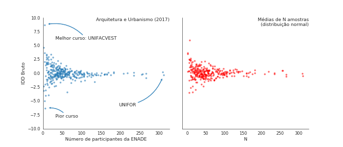

## Reliability of quality indicators for Brazilian higher education
This collection of notebooks should help reproduce an investigation into the reliability of [quality indicators for Brazilian higher education](http://portal.inep.gov.br/web/guest/indicadores-de-qualidade) produced by INEP.

In the [first notebook](1-CreateDataset.ipynb) we download the public data. 

Then, in the [second notebook](2-Correlations.ipynb) we show how the IDD is essentially a random number generator:

This evidence is corroborated by the (very low) correlations of the IDDs of the same course between 2014 and 2017, which is only 0.22. Here are the correlations for all areas:

Here's how the correlation for one area looks like:

In the third notebook we will take the IDD microdata and reproduce the IDDs that INEP calculated. We will show that INEP made a conceptual mistake in how they calculated this indicator since 2014. Fixing the mistake improves the reliability of the IDD somewhat, lifting the overall correlation between the 2014 and 2017 IDDs to 0.35. 

### TODO
* Bayesian modeling to get more reliable estimates for the standard errors on the intercepts. 
* requirements.txt
