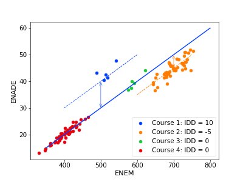

## Reliability of quality indicators for Brazilian higher education
This collection of notebooks should help reproduce an investigation into the reliability of [quality indicators for Brazilian higher education](http://portal.inep.gov.br/web/guest/indicadores-de-qualidade) produced by INEP. We focus on the IDD, one of the main (35% weight) inputs to the so-called CPC indicator ("Conceito Preliminar do Curso"), which is a high-stake indicator especially for private institutions since it determines wether an "in-loco" visit will take place for reaccreditation purposes. The IDD purports to be a value-added measure for course quality, controlling for student characteristics. However, at least since 2014 this indicator is calculated erroneously by INEP and is not reliable 

In the [first notebook](1-CreateDataset.ipynb) we download the public data. 

The [second notebook](2-CalculateIDDs.ipynb) contains the analysis of the 2019 microdata. I reproduce the IDD from INEP from the microdata of 2019 and show that the correct "Intercept" method is more reliable. Briefly, INEP uses a varying intercept model to regress the ENADE score of students on the ENEM score they had when they entered the course. The idea is we "control for" the ENEM score (taking it as a proxy for student characteristics).The part of ENADE that is not explained by ENEM (the sum of the residuals) can then be taken as an indicator for course quality. To show schematically how this would work, see this figure:

In this case we model the ENADE score with a varying intercept model, and the intercepts can be taken as the IDD or value-added measure. (Amost equivalently, we can also take the mean of the residuals taking into account only the main effect). 

But INEP made a conceptual mistake in how they calculated this indicator since 2014. Instead of the intercepts, we show that INEP's calculation takes (the mean of) the residuals of the full model. This doesn't make sense, since the intercept is exactly the characteristic of the course that we want to estimate. 

Here is a figure I generated earlier with data from 2017, the first indication that the IDD indicator is unreliable.

## Correlations between assessment cycles

In the [third notebook](3-Correlations.ipynb) we further investigate the reliability of the IDD indicator, doing a sort of test-retest analysis of the same courses in two different assessment cycles.Here's how the correlation for one area looks like (every point represents the IDD of course in 2014 and 2017)

Here are the correlations for all areas. In this graph we also show that the ENADE indicator (the raw results from the ENADE standardized test that graduates take) has better reliability, indicating that there is a problem with the way the IDD is calculated, aside from measurement uncertainties.

Although at first sight the correlations seem very low for reliability estimates, one could argue that it's not necessarily expected that a course presents the same or even similar quality indicators three years apart. After all, courses can change or adapt. Such a hypothetical adaptibility to quality assessment indicators One way to   

Fixing the mistake improves the reliability of the IDD somewhat, lifting the overall correlation between the 2014 and 2017 IDDs to 0.35. These calculations are made in the [fourth notebook](4-Correlations2.ipynb)

Concluding, we think the whole IDD and maybe CPC indicator should be revisited. The ENADE test has not been subjected to a reliability, let alone validity analysis. As a recent report from OECD said, the ENADE may not be "fit for purpose" and is much too ambitious. The fact that the CPC must be calculated for *all courses*, because it determines wether an in-loco visit will take place, is probably the reason that so many CPCs are being calculated with very few data points (from only two students, for example). It just cannot be expected that these indicators are reliable and basing policy on unreliable indicators makes everybody involved cynical and feeling like they are living in a chaotic reality, which in and of itself has a corrupting effect on the system.

### TODO
* Bayesian modeling to get more reliable estimates for the standard errors on the intercepts. 
* requirements.txt
